```{r setup, include=FALSE}
knitr::opts_chunk$set(echo = TRUE)
```

# 1. Pin-hole Optics

## 1.a
Assume:
$R_1= \frac{dp}{2}; \ R_2= \frac{dL}{2}; \ S = \frac{s}{dp}=\frac{2s}{R_1}$

### Area of Segment for any given circle
$\delta O = \pi R^2$
$\delta a= \pi R^2 - \delta a_i \rightarrow \frac{\delta a} {\delta O} = 1- \frac{\delta a_i}{\delta O} \\$

$\delta a_i = \pi R^2(\frac{2\alpha}{2\pi})-sh= R^2\alpha-s\sqrt{R^2-s^2}$

If: $S=\frac{s}{R} \rightarrow \alpha=cos^{-1}S \\$

$\frac{\delta a}{\delta O}=1-(cos^{-1}S-S\sqrt{1-S^2})$

### Relationship of two projections by given distance between intersection points

$R_1^2 - s_1^2 = R_2^2-s_2^2 \rightarrow s_2^2=R_2^2-R_1^2+s_1^2 \rightarrow s_2 =R_1\sqrt{\frac{1}{\rho}^2+S_1^2-1}$

$S_2 = \frac{s_2}{R_2} = \frac{2s_2}{d_L}= -\frac{R_1\sqrt{\frac{1}{\rho}^2+S_1^2-1}}{R_2}= \rho\sqrt{\frac{1}{\rho}^2+S_1^2-1}$

Finally,
$\frac{\delta a}{\delta O} = (\frac{\delta a}{\delta O})_{PPC} + (\frac{\delta a}{\delta O})_{Cl} \\$
$\frac{\delta a}{\delta O} =2-\frac{1}{\pi}(cos^{-1}S-S\sqrt{1-S^2} + cos^{-1}S_2-S_2\sqrt{1-S_2^2} \\$
$\frac{\delta a}{\delta O} =2-\frac{1}{\pi}(cos^{-1}S-S\sqrt{1-S^2} + cos^{-1}(\rho\sqrt{\frac{1}{\rho}^2+S_1^2-1})-(\rho\sqrt{\frac{1}{\rho}^2+S_1^2-1})\sqrt{1-(\rho\sqrt{\frac{1}{\rho}^2+S_1^2-1})^2}$

## 1.b

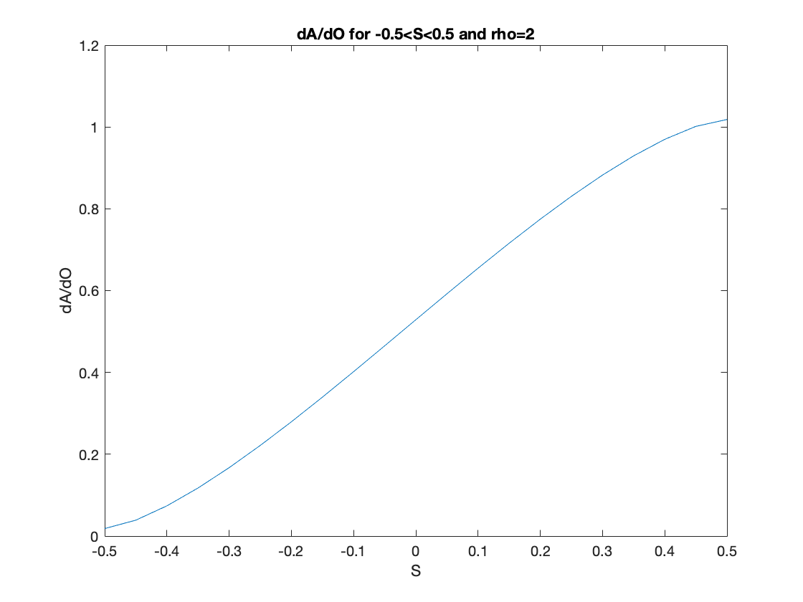{width=50%}

\newpage


# 2. Histogram Equalization

## 2.a


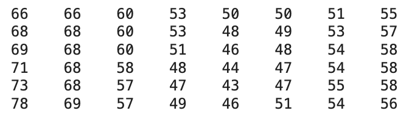{width=50%}


$\\$


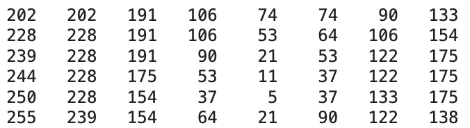{width=50%}


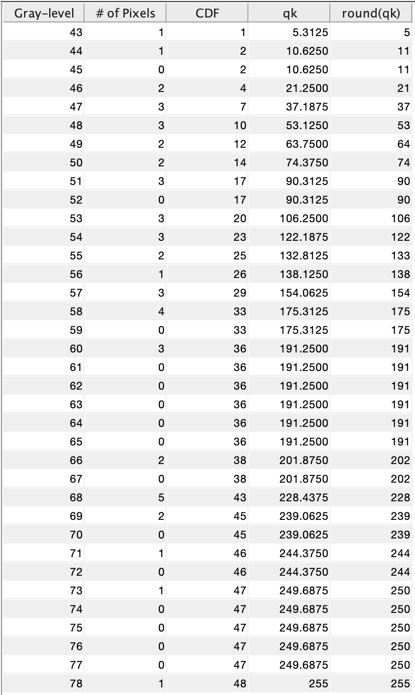{width=50%}

\newpage

## 2.b

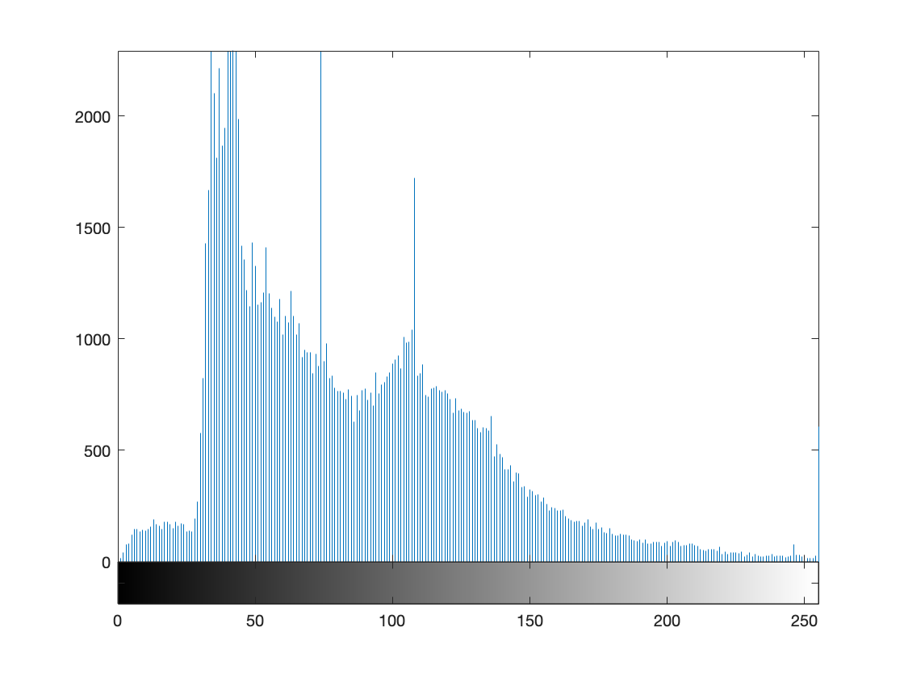{width=50%}


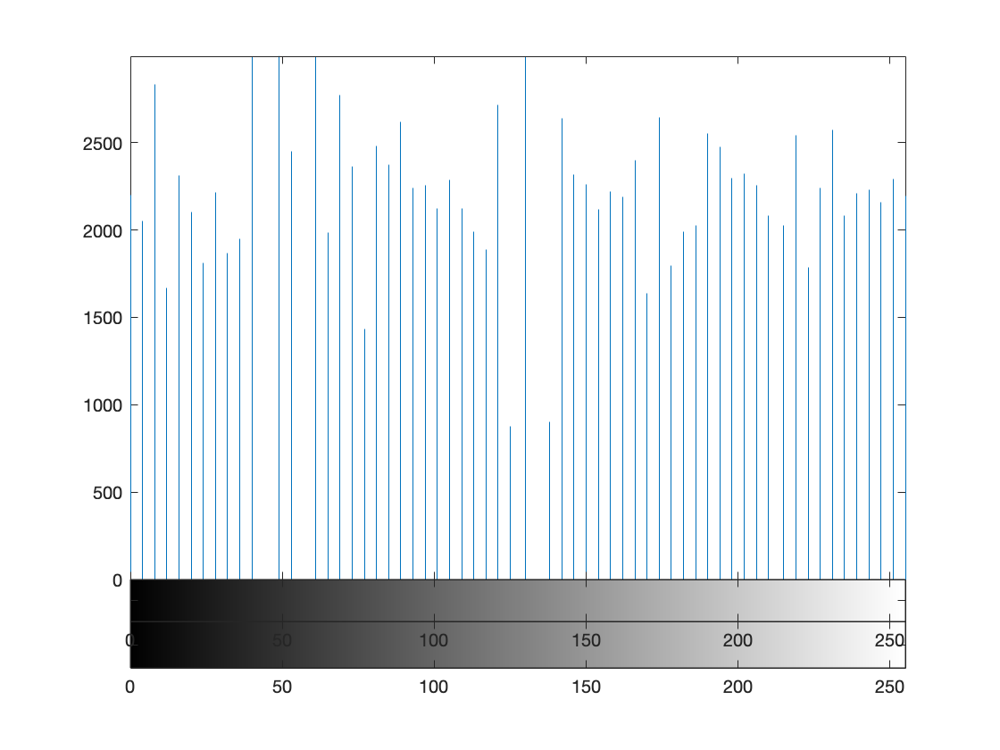{width=50%}


{width=50%}


\newpage


# 3. Filtering Masks

## 3.a 
The gradient magnitude is 18.601 and the direction is 53.746$^{\circ}$.


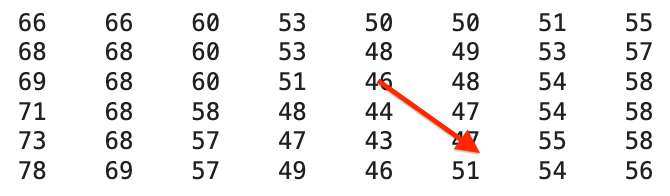{width=50%}


## 3.b

{width=100%}


{width=100%}

No differences between Matlab packages and own implementations are observed. 

\newpage
## 3.c

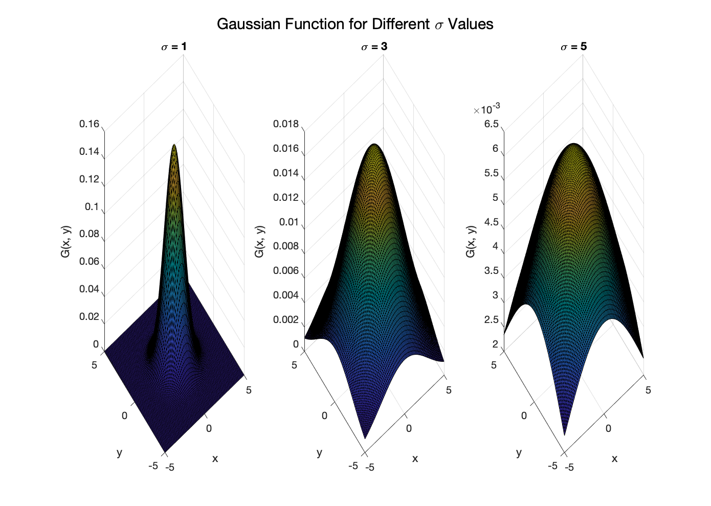{width=100%}


\newpage


## 3.d


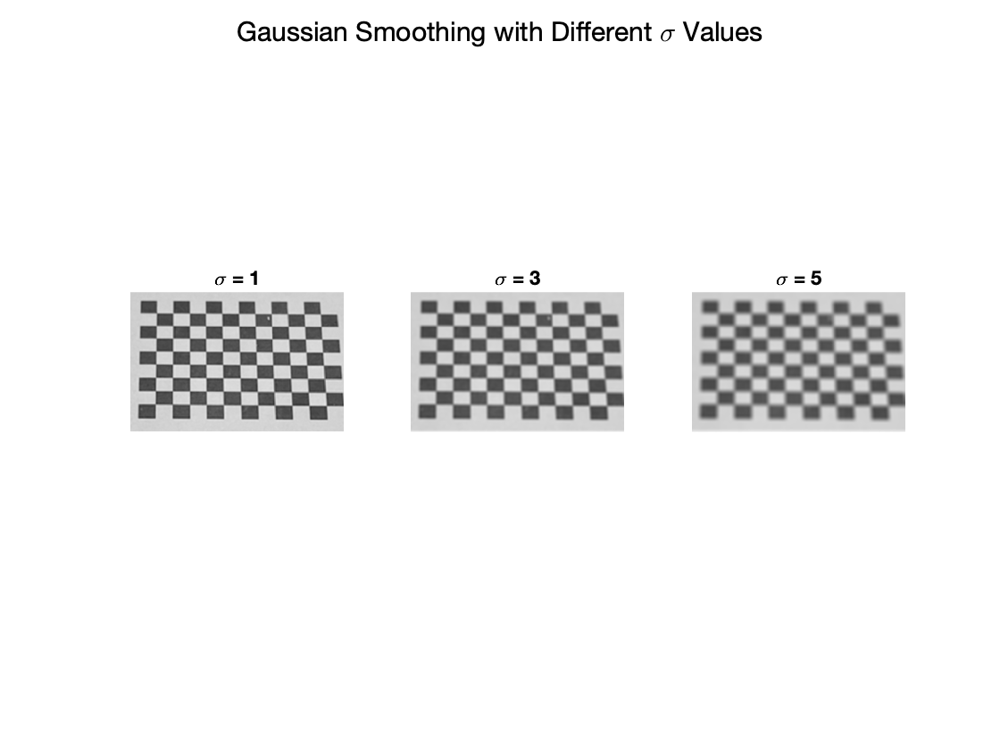{width=100%}

\newpage

## 3.e

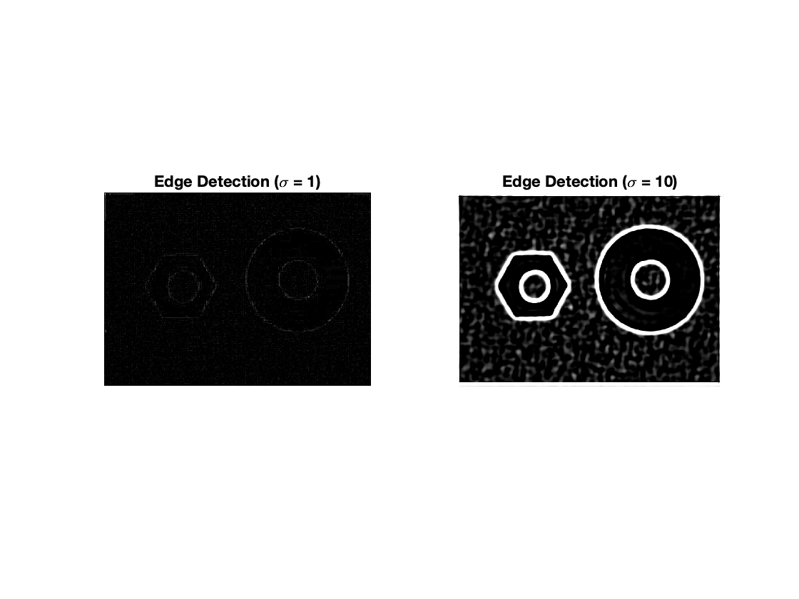{width=100%}
\newpage

## 3.f

### 3.f.i


### 3.f.ii

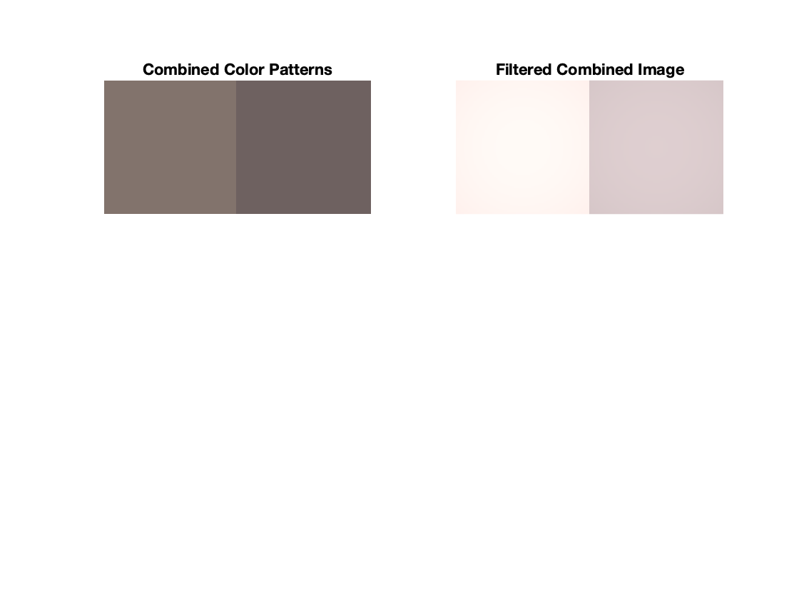{width=100%}


### 3.f.iii
Before Filtering: d = 29.46

After Filtering: d = 74.23

\newpage

# 4. Low-level Information Processing


## 4.a 

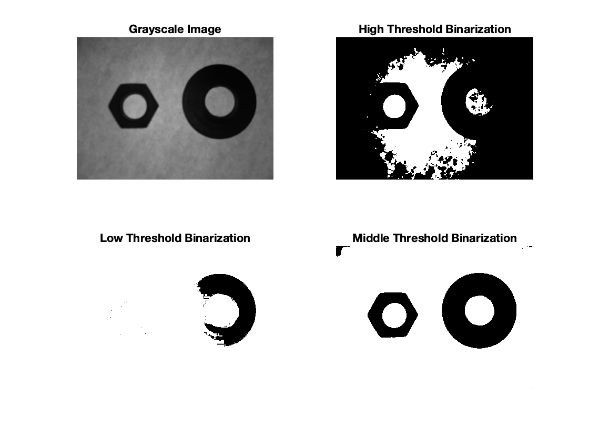{width=100%}


## 4.b

Nut Area: 10331
Nut Centroid: [ 272.15, 324.19 ]

Shell Area: 15072
Shell Centroid: [ 668,05, 301.27]


## 4.c

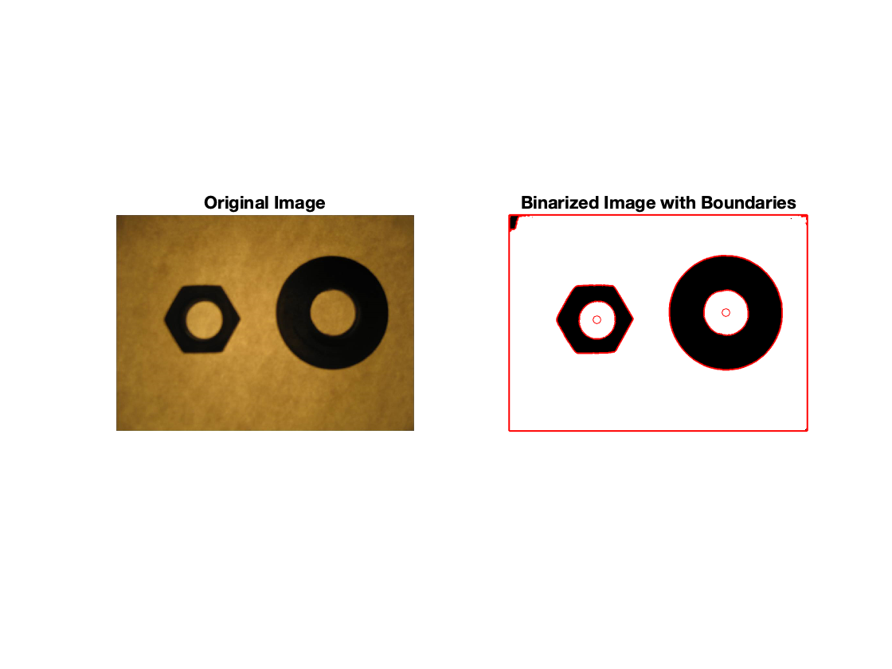{width=100%}


