```{r setup, include=FALSE}
knitr::opts_chunk$set(echo = TRUE)
```

# 1 Hough Transform

## 1.a
  
  
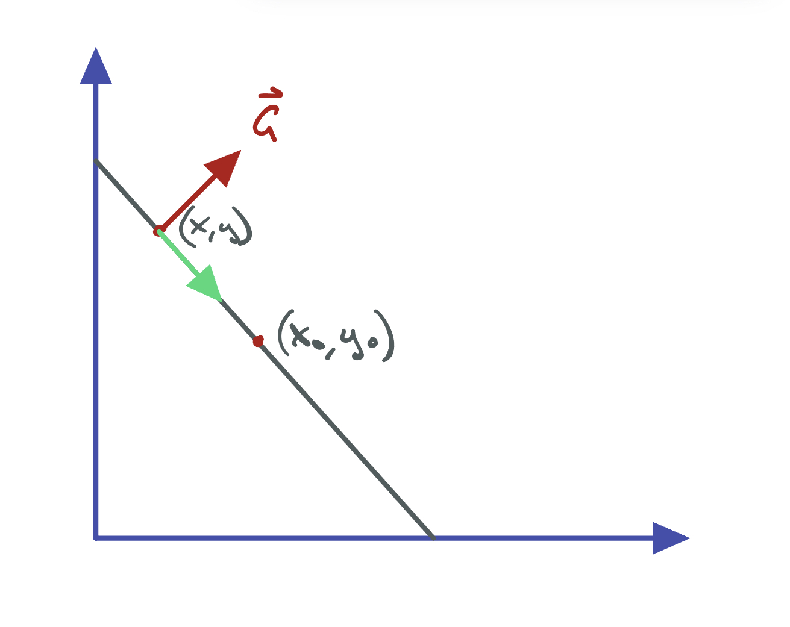{width=50%}


$eq1: \ y=ax+b; \\ eq2: \ y_0=ax_0+b$

$eq1-eq2 \rightarrow y-y_0=a(x-x_0)= a=\frac{y-y_0}{x-x_0}=\frac{-g_x}{g_y}=\frac{-x_0}{y_0}$

$\frac{y-y_0}{x-x_0}=\frac{-x_0}{y_0} \rightarrow x_0(x-x_0)+y_0(y-y_0)=0$

For $y_0=\frac{g_y x_0}{g_x}; \ x_0(x-x_0)+\frac{g_y x_0}{g_x}(y-\frac{g_y x_0}{g_x})=0$

Multiply by $gx^2$,

$x_0g_x^2(x-x_0)+g_y x_0(yg_x-g_y x_0)=0 \rightarrow x_0xg_x^2-g_x^2x_0 + x_0yg_yg_x - x_0^2g_y^2=0 \rightarrow x_0g_x(xg_x+yg_y) = x_o^2(g_x^2+g_y^2)$

$\frac{x_0^2}{x_0g_x}= \frac{xg_x + yg_y}{g_x^2 + g_y^2} \rightarrow x_0= g_x\frac{xg_x + yg_y}{g_x^2 + g_y^2}$

Since $x_0 = \frac{y_0g_x}{g_y}$,
$y_0= g_y\frac{xg_x + yg_y}{g_x^2 + g_y^2}$

Set $v=\frac{xg_x + yg_y}{g_x^2 + g_y^2}$

$\therefore \begin{bmatrix} x_0 \\ y_0\end{bmatrix}=v \begin{bmatrix} g_x \\ g_y \end{bmatrix}$

## 1.b

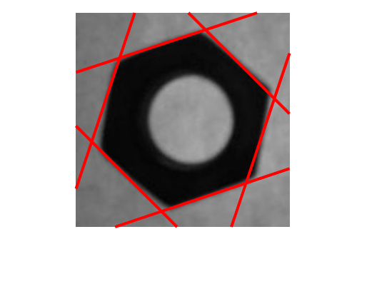{width=50%}


## 1.c
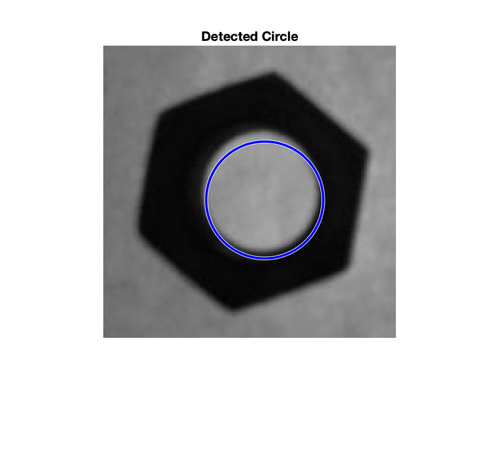{width=50%}
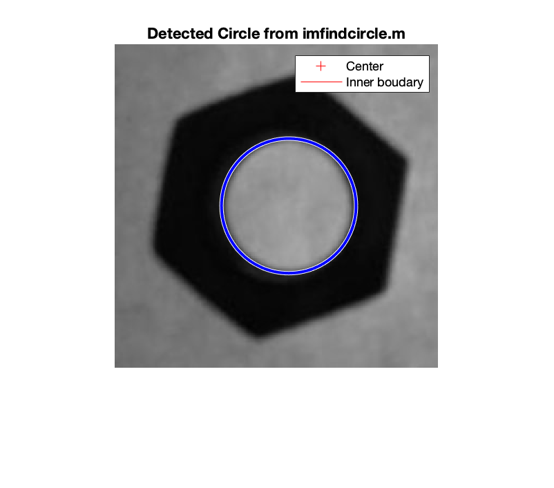{width=50%}


# 2 Feature Points Detection

## 2.a 

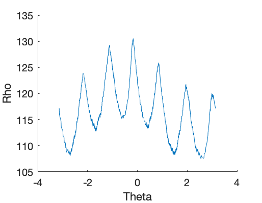{width=50%}
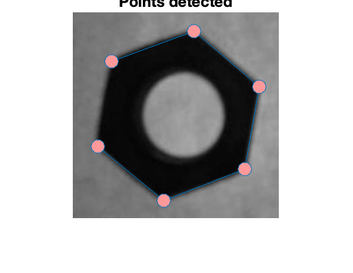{width=50%}


## 2.b
{width=50%}
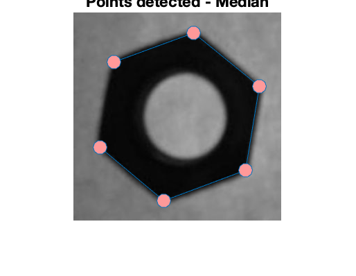{width=50%}

## 2.c

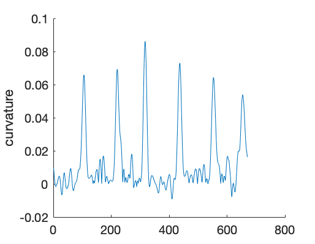{width=50%}
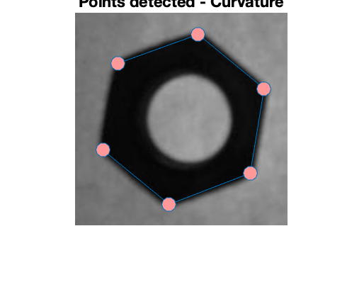{width=50%}


# 3. Tempate Matching

## 3.a

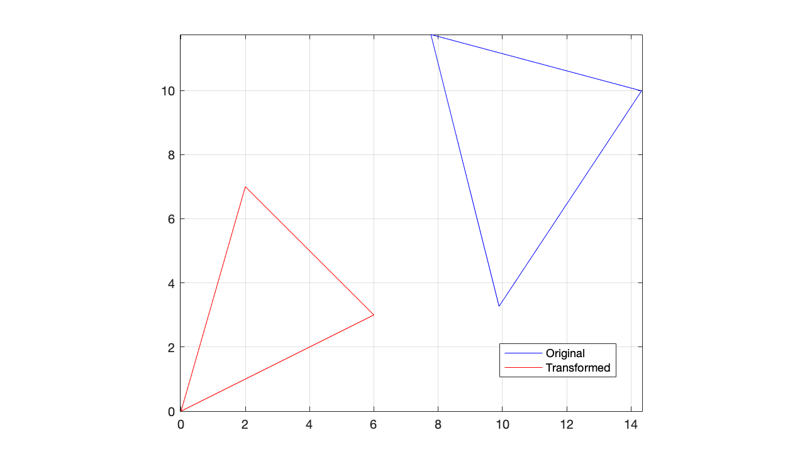{width=50%}


## 3.b

kd = 1.2

theta = 0.5236 rad = 30$^o$

xd = 5

yd = 5


These parameters match Table 1.

## 3.c

The match points are 2,3,5.


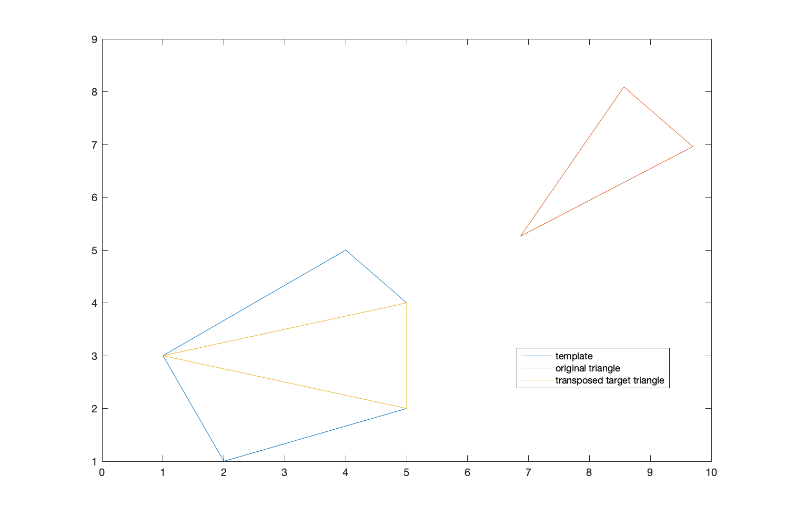{width=50%}


