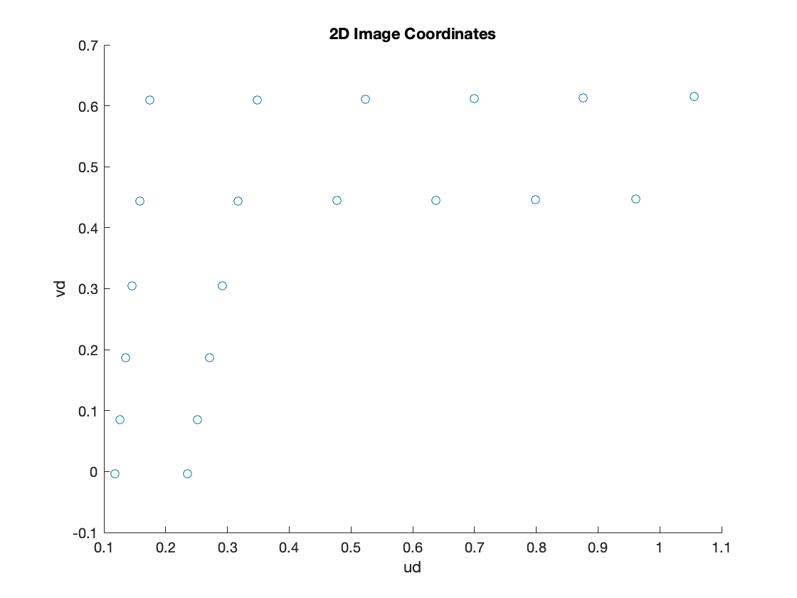
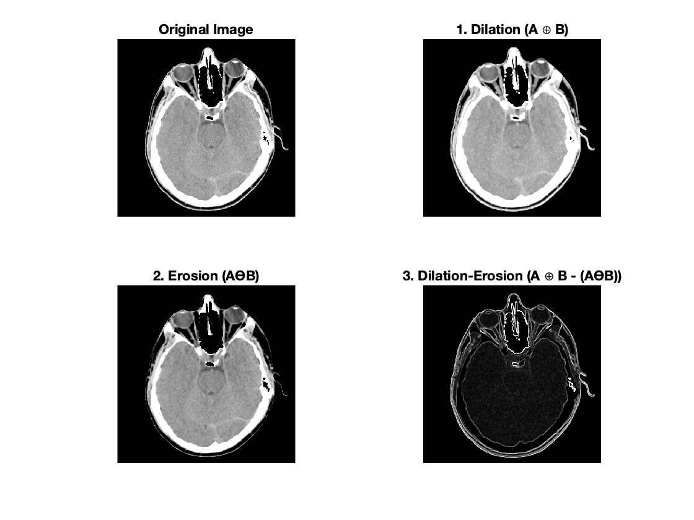

```{r setup, include=FALSE}
knitr::opts_chunk$set(echo = TRUE)
```

# 1. Camera Model and Calibration

## a)

{}

## b)

$f=1.3$

$[R]= \begin{bmatrix} 1 & 0 & 0 \\ 0 & -\frac{\sqrt{2}}{2} & \frac{\sqrt{2}}{2} \\ 0 & -\frac{\sqrt{2}}{2} & -\frac{\sqrt{2}}{2}\end{bmatrix}$

$T= \begin{bmatrix} 3 & 3.5 & -7.5\end{bmatrix}$


# 2. Morphology

## a)

{}

## b)

{}


# 3. Robot Eye-on-Hand Calibration

## 1)


$Rc12 = \begin{bmatrix} -0.0958   & 0.9346  & -0.3425 \\ -0.8060 &  -0.2747   &-0.5243  \\ -0.5841  &  0.2258 &   0.7797 \end{bmatrix}$

$Rc23 = \begin{bmatrix} 0.0041   & -0.2779  & 0.9606 \\ 0.4665 &  0.8502   & 0.2440  \\ -0.8845  &  0.4471 &   0.1331 \end{bmatrix}$

$Tc12 = \begin{bmatrix}     4.893\\  4.8245 \\-1.9306 \end{bmatrix}$

$Tc23= \begin{bmatrix}   -4.4892\\     -1.2969 \\   8.5167 \end{bmatrix}$

## 2)

$\theta_{Rc12} = 107.1822$


$n_{Rc12} =\begin{bmatrix} 0.3926 \\ 0.1265 \\ -0.9110\end{bmatrix}$


$\theta_{Rc23} = 90.3601$


$n_{Rc23} =\begin{bmatrix} 0.1016 \\ 0.9226 \\ 0.3722\end{bmatrix}$


$\theta_{Rg12} = 107.1722$


$n_{Rg12} =\begin{bmatrix} -0.1268 \\ 0.3927 \\ -0.9109\end{bmatrix}$

$\theta_{Rg23} = 90.3553$

$n_{Rg23} =\begin{bmatrix} -0.9225 \\ 0.1014 \\ 0.3723\end{bmatrix}$


## 3)

$Pc12 = \begin{bmatrix}     0.6319\\  0.2035 \\-1.4663 \end{bmatrix}$

$Pc23 = \begin{bmatrix}     0.1441\\  1.3088 \\0.5281 \end{bmatrix}$

$Pg12 = \begin{bmatrix}     -0.2041\\  0.6320 \\-1.4661 \end{bmatrix}$

$Pg23 = \begin{bmatrix}     -1.3087\\  0.1438 \\0.5282 \end{bmatrix}$

    

## 4)

$Pcg = \begin{bmatrix}     -0.0003\\  -0.0001 \\-1.4143 \end{bmatrix}$

$Rcg = \begin{bmatrix}     -0.0002 & 1 & 0.0001\\  -1 & -0.0002 & 0.0003\\ 0.0003 & -0.0001 & 1\end{bmatrix}$

$Tcg = \begin{bmatrix}     -1.7696\\  6.1870 \\2.9136 \end{bmatrix}$


# 4. Ellipse-Circle Correspondence

## 1)
$O = \begin{bmatrix} 1.6739& -0.6527 & 1.8853  \end{bmatrix}$


## 2)

$(x-1.6739)^2 + (y+0.6527)^2 + (z-1.8853)^2 -7.5^2 = 0$
