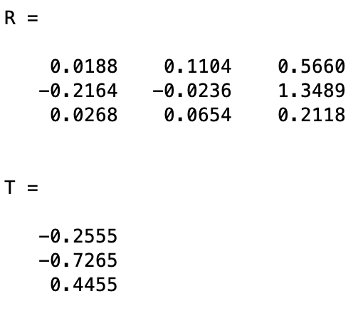
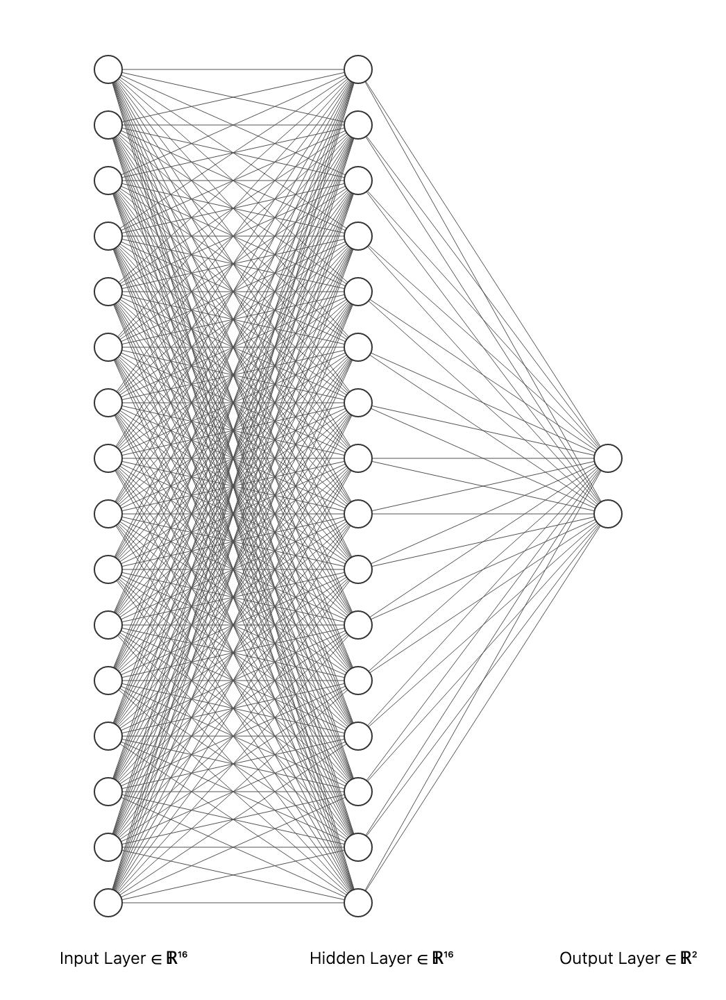
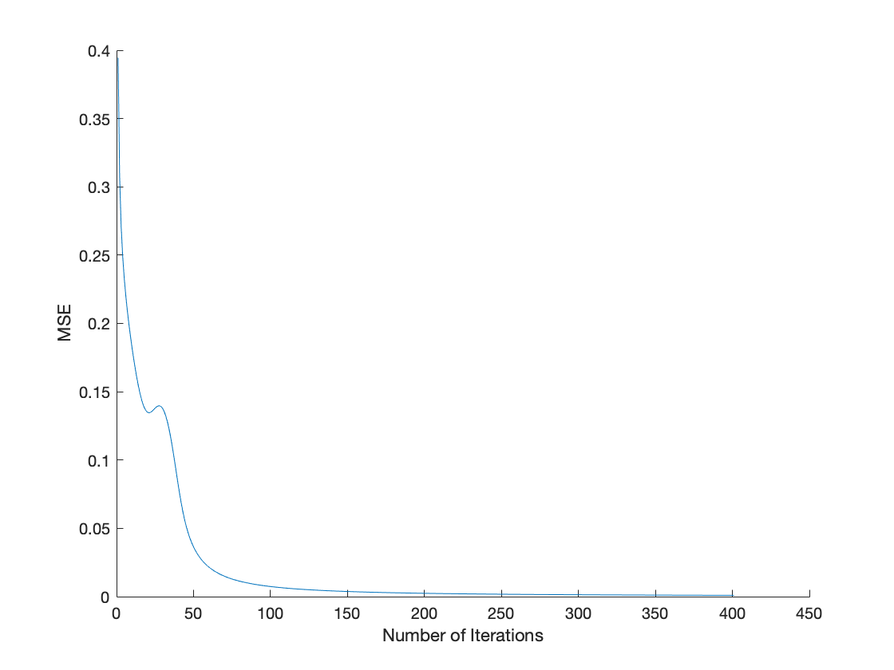
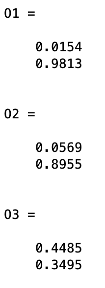
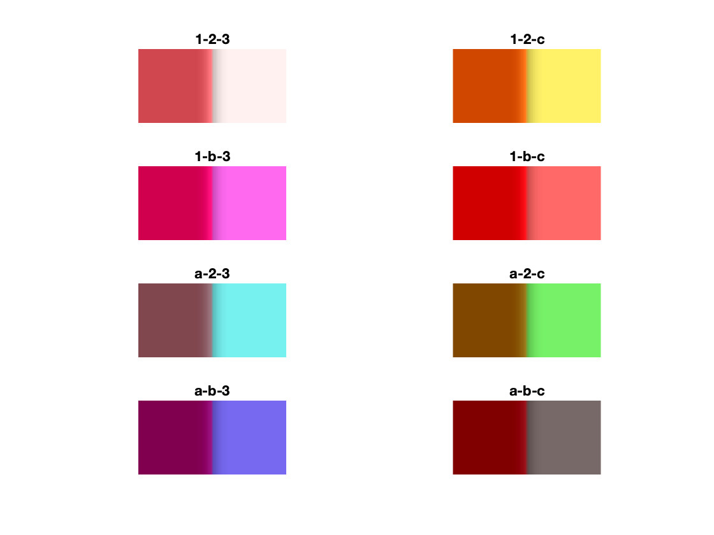
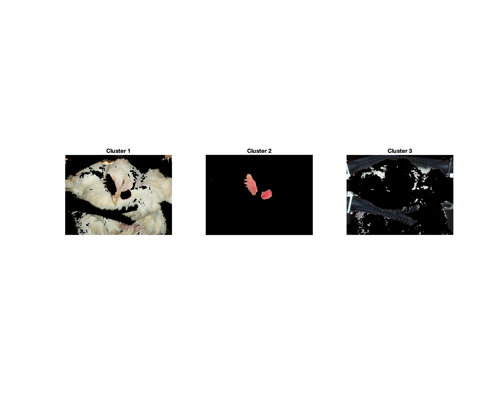
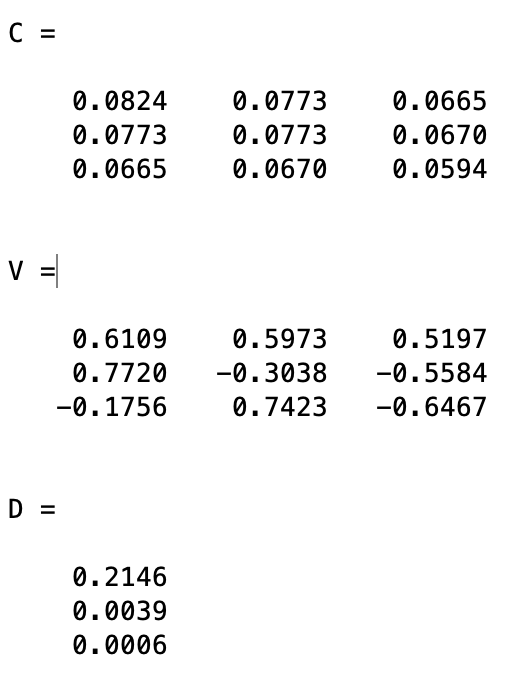
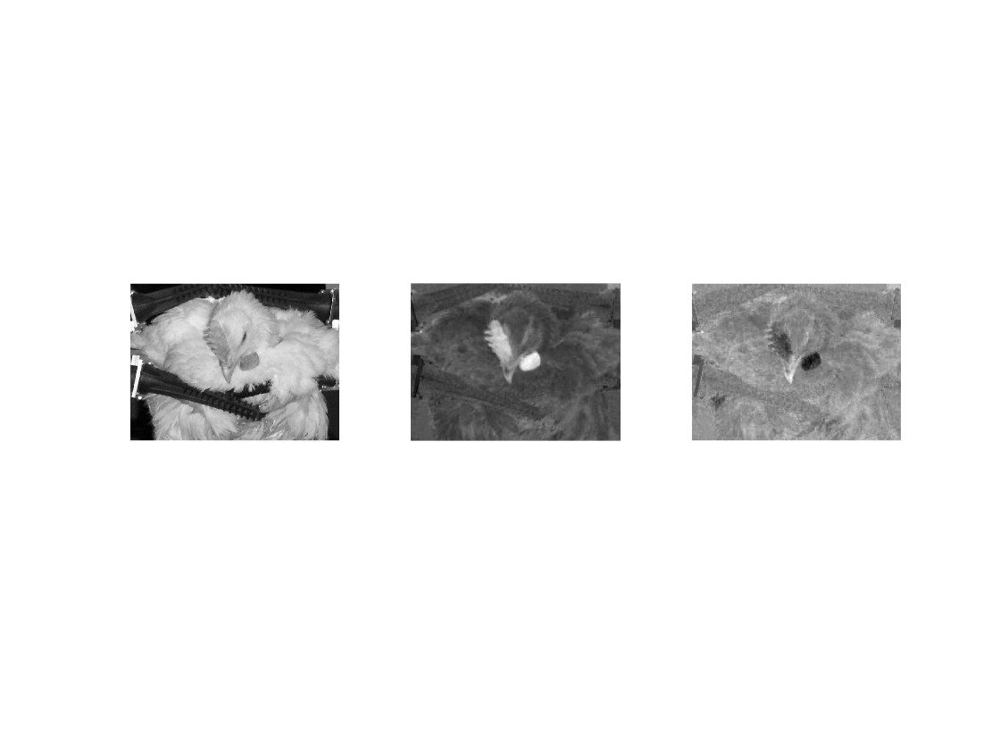

```{r setup, include=FALSE}
knitr::opts_chunk$set(echo = TRUE)
```

# 1 Pose Estimatiom

## 1.a


## 1.b




# 2. Artificial Neural Network

## 2.a 

There is 1 hidden layer, 16 inputs for each pixel, and 2 outputs for the 2 different structures. 



## 2.b


## 2.c



## 2.d 


Based on the output values, the model seems to predict the structure with accuracy.

# 3. Color

## 3.I ACC





## 3.II Color-based Image Segmentation




## 3.III PCA 






